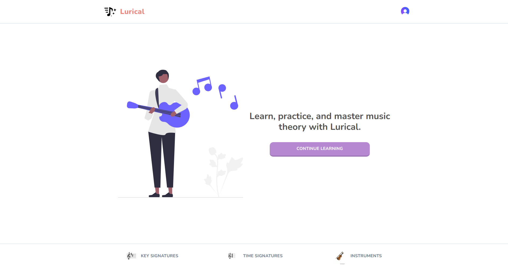
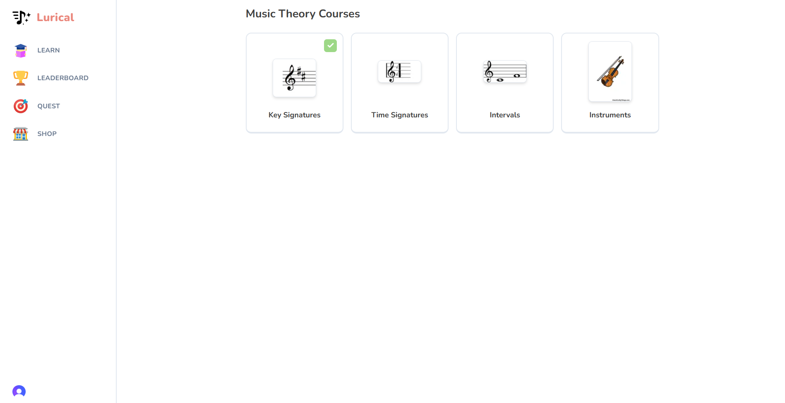
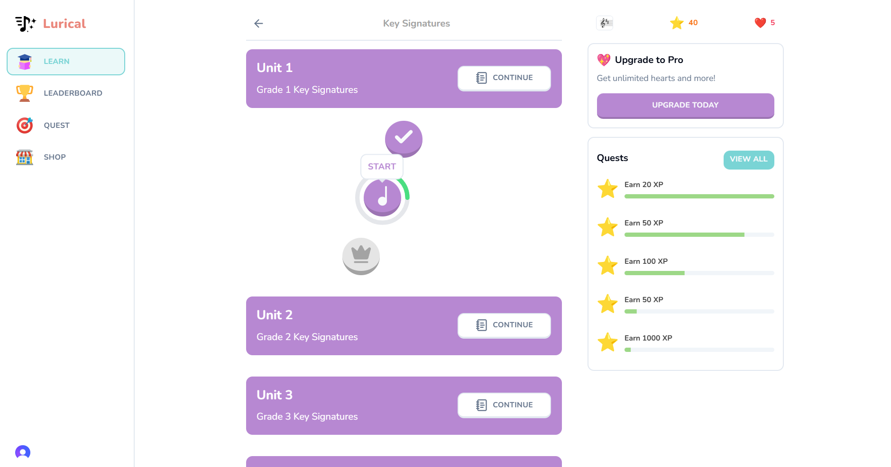
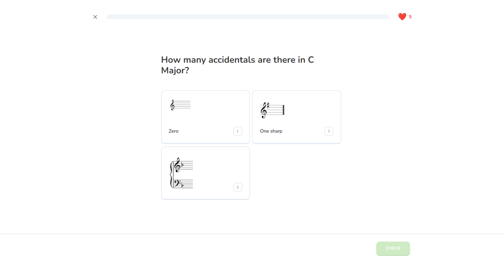
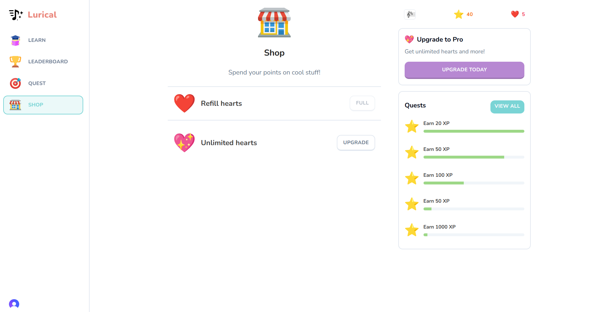

# Lurical Music Theory App

## Tools used: Next.js, React, Drizzle, Stripe

Lurical is a Next.js project bootstrapped with create-next-app. Inspired by the language-learning app Duolingo, I had an idea to create a gamified experience for learning music theory.

Explore the app [here](https://lurical.vercel.app/).

